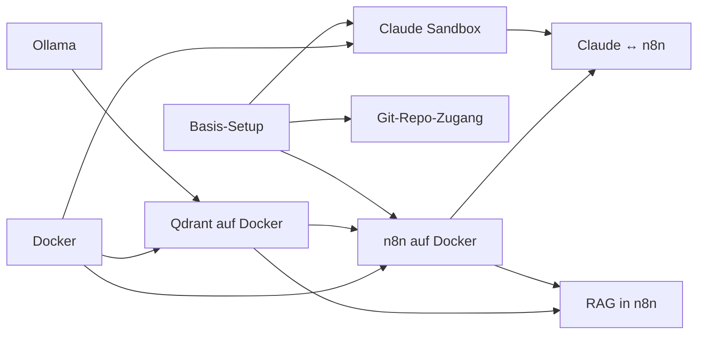

# Manuals

**Language:** [English](README.md)

> Die Markdown-Files der Anleitungen befinden sich hier: **[github.com/intersections-ch/manuals](https://github.com/intersections-ch/manuals)**

Neu hier? Fang mit [Basis-Setup](manuals/basic-setup.de.md) an, das der Reihe nach durch die anderen Manuals führt.
Sonst nimm das Manual, das du brauchst, und arbeite es durch. Früh fertig? Nimm das nächste.
Kommst du nicht weiter, wende dich an die Kursleitung oder frage einen Chatbot um Unterstützung. 
Du kannst die Anleitungen unter `https://github.com/intersections-ch/manuals` herunterladen und als Kontext in einen Chatbot einfügen.
Auch Verständnisfragen können oft von Chatbots gut beantwortet werden. 

| Manual | Was du bekommst | Voraussetzungen |
|---|---|---|
| [Basis-Setup](manuals/basic-setup.de.md) | Die ganze Kursumgebung, der Reihe nach | — |
| [Claude Sandbox](manuals/claude-sandbox.de.md) | Claude Code in einer isolierten Docker-Box | Docker |
| [Git-Repo-Zugang](manuals/git-repo.de.md) | SSH-Key + das Kurs-Repo auf deinem Computer | — |
| [Qdrant auf Docker](manuals/qdrant-docker.de.md) | Lokale Vektordatenbank | Docker, Ollama |
| [n8n auf Docker](manuals/n8n-docker.de.md) | Lokaler Automatisierungsserver | Docker, Qdrant |
| [RAG in n8n](manuals/n8n-rag.de.md) | Zwei Workflows: ein Chat-Agent mit Gedächtnis | Qdrant, n8n |
| [Claude ↔ n8n (MCP)](manuals/claude-mcp-n8n.de.md) | Claude spricht mit deinem n8n | n8n, Claude Sandbox |
| [Ollama](manuals/ollama.de.md) | Lokale LLMs auf deinem Computer (gemma4:e2b, nomic-embed-text) | — |

## Reihenfolge

Git, ein Terminal und ein Code-Editor werden vorausgesetzt. Docker nicht — siehe die Notiz oben in jedem Manual, das es braucht.

Jedes Manual hat einen deutschen Zwilling unter `<slug>.de.md`, verlinkt in der Kopfzeile jeder Seite.
