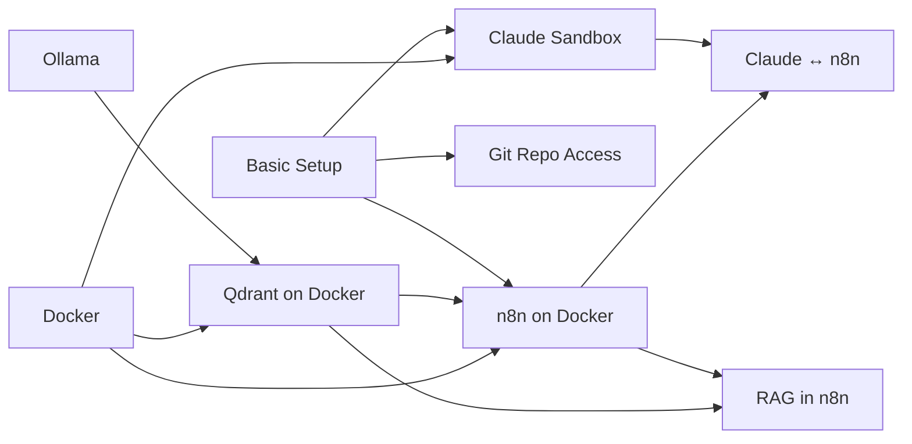

# Manuals

**Sprache:** [Deutsch](README.de.md)

> The markdown files for these manuals live here: **[github.com/intersections-ch/manuals](https://github.com/intersections-ch/manuals)**

New here? Start with [Basic Setup](manuals/basic-setup.md), which walks through the other manuals in order.
Otherwise pick whichever one you need and work through it. Done early? Start the next one.
If you get stuck, ask one of the instructors or ask the chatbot of your choice for help.
You can download all the manual files at `https://github.com/intersections-ch/manuals` and provide it as context to your chatbot.
Chatbots usually also do a good job at answering comprehension questions. 

| Manual | What you get | Requires |
|---|---|---|
| [Basic Setup](manuals/basic-setup.md) | The whole course environment, in order | — |
| [Claude Sandbox](manuals/claude-sandbox.md) | Claude Code in an isolated Docker box | Docker |
| [Git Repo Access](manuals/git-repo.md) | SSH key + the course repo on your computer | — |
| [Qdrant on Docker](manuals/qdrant-docker.md) | Local vector database | Docker, Ollama |
| [n8n on Docker](manuals/n8n-docker.md) | Local automation server | Docker, Qdrant |
| [RAG in n8n](manuals/n8n-rag.md) | Two workflows: a chat agent with a memory | Qdrant, n8n |
| [Claude ↔ n8n (MCP)](manuals/claude-mcp-n8n.md) | Claude talks to your n8n | n8n, Claude Sandbox |
| [Ollama](manuals/ollama.md) | Local LLMs on your computer (gemma4:e2b, nomic-embed-text) | — |

## Order

Git, a terminal and a code editor are assumed. Docker isn't — see the note at the top of each manual that needs it.

Every manual has a German twin at `<slug>.de.md`, linked from the header line of each page.
