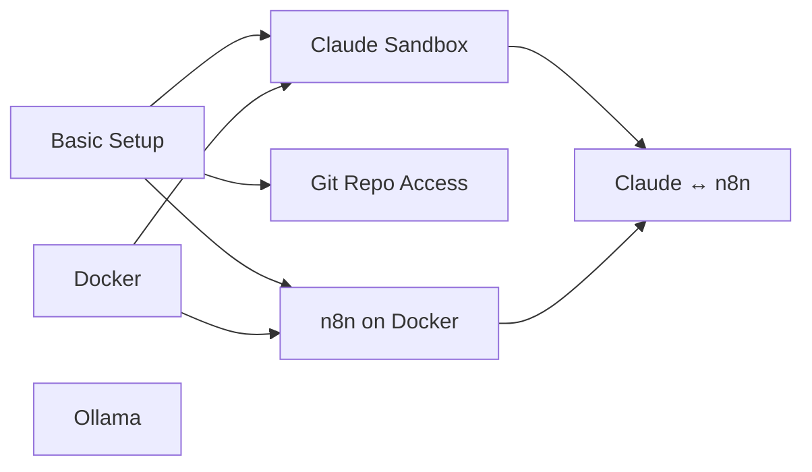

# Manuals

**Sprache:** [Deutsch](README.de.md)

New here? Start with [Basic Setup](manuals/basic-setup.md) — it walks the other manuals in order.
Otherwise pick one, follow it, try the things at the end. Done early? Start the next one.
Stuck? Ask Claude — paste the error, it usually knows.

| Manual | What you get | Requires |
|---|---|---|
| [Basic Setup](manuals/basic-setup.md) | The whole course environment, in order | – |
| [Claude Sandbox](manuals/claude-sandbox.md) | Claude Code in an isolated Docker box | Docker |
| [Git Repo Access](manuals/git-repo.md) | SSH key + the course repo on your machine | – |
| [n8n on Docker](manuals/n8n-docker.md) | Local automation server | Docker |
| [Claude ↔ n8n (MCP)](manuals/claude-mcp-n8n.md) | Claude talks to your n8n | n8n, Claude Sandbox |
| [Ollama](manuals/ollama.md) | Local LLMs on your machine | – |

## Order

Git, a terminal and a code editor are assumed. Docker isn't — see the note at the top of each manual that needs it.

Every manual has a German twin at `<slug>.de.md`, linked from the header line of each page.
