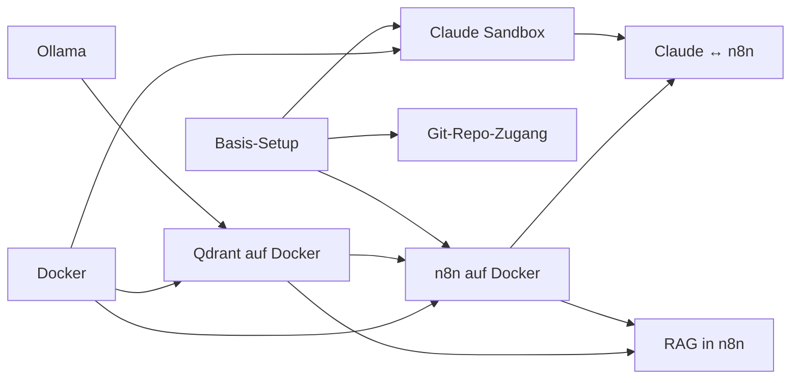

## Reihenfolge

```mermaid
graph LR
  setup[Basis-Setup] --> sbx[Claude Sandbox]
  setup --> git[Git-Repo-Zugang]
  setup --> n8n[n8n auf Docker]
  sbx --> mcp[Claude ↔ n8n]
  n8n --> mcp
  qdrant[Qdrant auf Docker] --> n8n
  n8n --> rag[RAG in n8n]
  qdrant --> rag
  ollama[Ollama] --> qdrant
  docker[Docker] --> sbx
  docker --> qdrant
  docker --> n8n
```

Git, ein Terminal und ein Code-Editor werden vorausgesetzt. Docker nicht — siehe die Notiz oben in jedem Manual, das es braucht.
