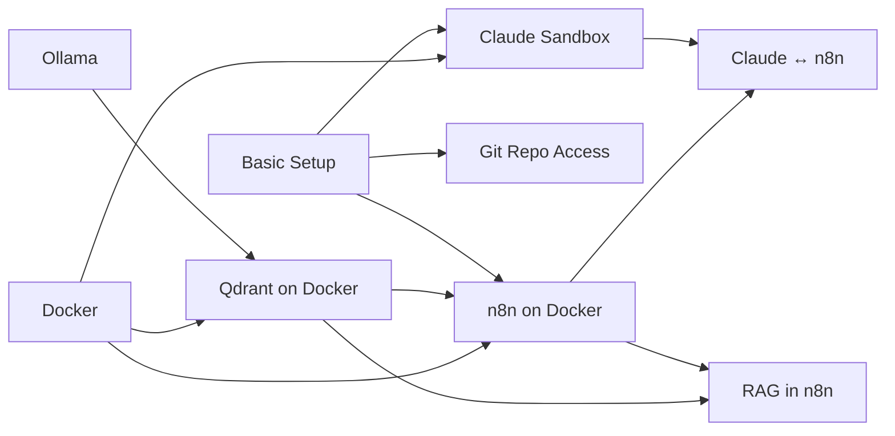

## Order

```mermaid
graph LR
  setup[Basic Setup] --> sbx[Claude Sandbox]
  setup --> git[Git Repo Access]
  setup --> n8n[n8n on Docker]
  sbx --> mcp[Claude ↔ n8n]
  n8n --> mcp
  qdrant[Qdrant on Docker] --> n8n
  n8n --> rag[RAG in n8n]
  qdrant --> rag
  ollama[Ollama] --> qdrant
  docker[Docker] --> sbx
  docker --> qdrant
  docker --> n8n
```

Git, a terminal and a code editor are assumed. Docker isn't — see the note at the top of each manual that needs it.
